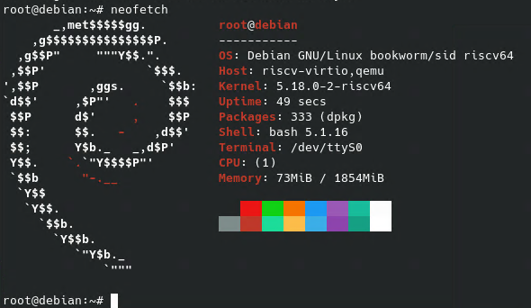

# 在 Debian 上构建 Debian RISC-V QEMU 镜像

## 安装 QEMU 与其他环境

*QEMU 的环境配置与 Ubuntu 上相同，在此不做过多赘述。

```bash
$ sudo apt install qemu-system-misc qemu-user-static binfmt-support opensbi u-boot-qemu
```

## Debian-Ports

Debian 支持各种各样的指令集，但基于更现实的原因，Debian 官方只维护几个 ports（official ports），比如 amd64、arm64 和 mips64el。

而 riscv64 并不在官方的源之中，所以我们要添加 debian ports 源。

在 `/etc/apt/sources.list` 中添加

```bash
deb http://deb.debian.org/debian-ports sid main
deb http://deb.debian.org/debian-ports unreleased main
deb-src http://deb.debian.org/debian sid main
```

同时安装 Debian Ports 的公钥链

```bash
$ sudo apt install debian-ports-archive-keyring
$ sudo apt update
```

## 创建 riscv64 的 chroot

我们使用 mmdebstrap 来创建一个 riscv64 的 chroot

```bash
$ sudo apt install mmdebstrap qemu-user-static binfmt-support debian-ports-archive-keyring
$ sudo mmdebstrap --architectures=riscv64 --include="debian-ports-archive-keyring" sid /tmp/riscv64-chroot "deb http://deb.debian.org/debian-ports sid main" "deb http://deb.debian.org/debian-ports unreleased main"

I: automatically chosen mode: root
I: riscv64 cannot be executed, falling back to qemu-user
I: automatically chosen format: directory
I: running apt-get update...
done
I: downloading packages with apt...
done
I: extracting archives...
done
I: installing essential packages...
done
I: installing remaining packages inside the chroot...
done
done
I: cleaning package lists and apt cache...
done
done
I: success in 405.1753 seconds
```

时间会比较久，可以切出去摸个鱼（不是）。

等你回来，chroot 应该已经在 /tmp/riscv64-chroot 下安装好了

我们切换过去为之后的虚拟化做准备：

```bash
$ sudo chroot /tmp/riscv64-chroot
```

```bash
# 滚个更新先
$ apt update
# 配一下 DCHP
$ cat >>/etc/network/interfaces <<EOF
auto lo
iface lo inet loopback

auto eth0
iface eth0 inet dhcp
EOF
# 修改 root 密码
$ passwd
# 禁用 hvc0 上的 getty 防止和 QEMU 冲突
$ ln -sf /dev/null /etc/systemd/system/serial-getty@hvc0.service  
# 安装 riscv64 的内核和 bootloader
$ apt install linux-image-riscv64 u-boot-menu
# 安装和配置 NTP 服务
$ apt install openntpd ntpdate
$ sed -i 's/^DAEMON_OPTS="/DAEMON_OPTS="-s /' /etc/default/openntpd
# 配置启动菜单
$ cat >>/etc/default/u-boot <<EOF
U_BOOT_PARAMETERS="rw noquiet root=/dev/vda1"
U_BOOT_FDT_DIR="noexist"
EOF
u-boot-update
# 收工
$ exit
```

## 打包镜像

在此我们已经做好了基础镜像，可以打包试着用虚拟机跑一下了！

```bash
sudo apt-get install libguestfs-tools
sudo virt-make-fs --partition=gpt --type=ext4 --size=10G /tmp/riscv64-chroot/ rootfs.img
sudo chown ${USER} rootfs.img
```

`rootfs.img` 就是我们打包完的镜像

## 启动

```bash
qemu-system-riscv64 -nographic -machine virt -m 1.9G \
 -bios /usr/lib/riscv64-linux-gnu/opensbi/generic/fw_jump.elf \
 -kernel /usr/lib/u-boot/qemu-riscv64_smode/uboot.elf \
 -object rng-random,filename=/dev/urandom,id=rng0 -device virtio-rng-device,rng=rng0 \
 -append "console=ttyS0 rw root=/dev/vda1" \
 -device virtio-blk-device,drive=hd0 -drive file=rootfs.img,format=raw,id=hd0 \
 -device virtio-net-device,netdev=usernet -netdev user,id=usernet,hostfwd=tcp::22222-:22
```

来跑个 `neofetch`



好耶，他工作！

## 参考

https://wiki.debian.org/RISC-V

https://www.debian.org/ports/