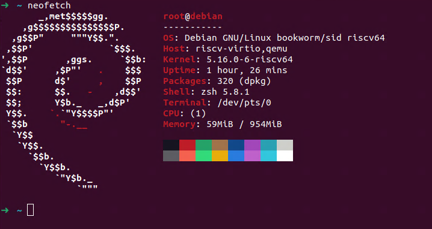

# 在 Ubuntu 21.10 上使用 QEMU 运行 Debian RISC-V

0x00 主机环境 与 0x01 QEMU RISC-V 环境···配置 与上篇相同。

## 0x02 启动 Debian 虚拟机

下载 [QDIB](https://people.debian.org/~gio/dqib/) 每周构建的 [RISC-V 64 开发镜像](https://gitlab.com/api/v4/projects/giomasce%2Fdqib/jobs/artifacts/master/download?job=convert_riscv64-virt) 。

下方演示的为普通虚拟机模式而不是 chroot 模式。

我们还需要 opensbi 和 u-boot-qemu：

```bash
sudo apt install opensbi u-boot-qemu
```

然后检查一下 qemu

```bash
➜  ~ qemu-system-riscv64 --version
QEMU emulator version 6.0.0 (Debian 1:6.0+dfsg-2expubuntu1.2)
Copyright (c) 2003-2021 Fabrice Bellard and the QEMU Project developers
```

确定 qemu 安装正确后：

```bash
qemu-system-riscv64 \ 
  -machine virt \
  -cpu rv64 -m 1G \
  -device virtio-blk-device,drive=hd -drive file=image.qcow2,if=none,id=hd \
  -device virtio-net-device,netdev=net -netdev user,id=net,hostfwd=tcp::2022-:22 \
  -bios /usr/lib/riscv64-linux-gnu/opensbi/generic/fw_jump.elf \
  -kernel /usr/lib/u-boot/qemu-riscv64_smode/uboot.elf \
  -object rng-random,filename=/dev/urandom,id=rng \
  -device virtio-rng-device,rng=rng -nographic \
  -append "root=LABEL=rootfs console=ttyS0"
```

ssh 过去，很顺利：

```bash
➜  ~ ssh root@127.0.0.1 -p 2222   
root@127.0.0.1's password: 
Linux debian 5.16.0-6-riscv64 #1 SMP Debian 5.16.18-1 (2022-03-29) riscv64

The programs included with the Debian GNU/Linux system are free software;
the exact distribution terms for each program are described in the
individual files in /usr/share/doc/*/copyright.

Debian GNU/Linux comes with ABSOLUTELY NO WARRANTY, to the extent
permitted by applicable law.
Last login: Tue Apr 19 17:46:48 2022 from 10.0.2.2
root@debian:~# 
```

相对来说都很顺利，跑个 neofetch：



好耶，它工作！

## 参考：

https://wiki.debian.org/RISC-V